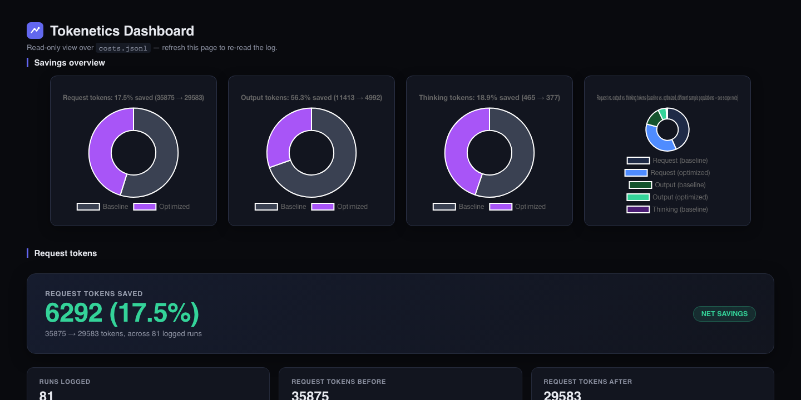
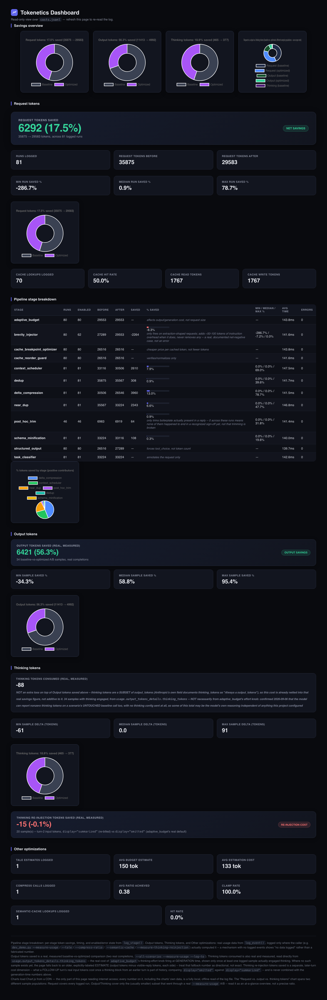

# Tokenetics

**Makes calls to Claude cheaper, automatically — without changing the quality of the answers you get back.**

[](https://github.com/Dishti-Oberai/tokenetics/actions/workflows/ci.yml)




<sub>Real data from this repo's own benchmark runs. [Full dashboard →](#dashboard)</sub>

---

You already know the deal: every word you send Claude costs money, every word it sends back costs money, and long conversations mean paying — often for the same repeated instructions, tool definitions, and history, over and over.

Tokenetics sits between your code and the Anthropic API. Hand it your request, it trims the waste (duplicate content, stale context, over-verbose replies), and passes a leaner version through. No prompt rewrites, no infrastructure to run, no model call of its own in the core path.

```python
from tokenetics import Tokenetics

tk = Tokenetics()                          # every optimization on by default
request = tk.prepare(messages=messages, tools=tools)
response = client.messages.create(**request)   # your normal Anthropic SDK call
stored = tk.finalize(response)             # cleans the reply before you store it
```

## Why it's different from "prompt engineering harder"

- **Optimizes both directions** — most advice only shrinks what you send; Tokenetics also shapes what Claude generates back.
- **Understands Anthropic's real cache pricing** — 5-minute vs. 1-hour tiers, write premiums, read discounts — and picks for you instead of you guessing.
- **Never claims a saving it didn't measure** — every number is tagged *measured* or *estimated*, never one dressed up as the other.
- **Never breaks your request** — any step that's unsure backs off and passes your request through unchanged. One deliberate exception exists (a cache-safety guard), explained below.

## What it is — and isn't

A small library you import — wherever you call `client.messages.create(...)`, you pass the request through Tokenetics first. It is **not** a Claude Code plugin, not a proxy/server, and its "always on" core doesn't use another model call — that's an opt-in extra, not the default.

## Install

```bash
git clone https://github.com/Dishti-Oberai/tokenetics.git
cd tokenetics
uv sync          # install dependencies
uv run pytest    # run the full test suite
```

Not yet on PyPI — publish is the one remaining distribution step. Needs Python 3.10+; an [Anthropic API key](https://console.anthropic.com/) only if you want real Claude calls, not for the test suite.

## How a request flows through it

A fixed sequence, always in this order — each step is individually toggleable, but the *order* never changes, since later steps depend on what earlier ones guarantee.

```
 1. Remove exact duplicates
 2. Remove near-duplicates
 3. Classify the task type          ─┐ reused by steps 4, 5, 8, 9
 4. Trim unneeded tool definitions   │
 5. Keep only the messages worth it  │
 6. Send diffs, not whole payloads  ─┘
 7. Arrange for caching + safety check   ← the one hard-raise, see below
 8. Decide where the cache breakpoint goes
 9. Configure the response  (structured output · brevity · length & reasoning cap)
10. ── request sent to Claude ──
11. Strip boilerplate from the reply before it's stored
```

<details>
<summary><b>What each step actually solves</b> (click to expand)</summary>

| Step | Problem | Fix |
|---|---|---|
| 1. Dedup | Identical text sent twice, billed twice. | Fingerprint each chunk; drop repeats, keep the first. |
| 2. Near-dup | Content that's *basically* the same but not byte-identical. | MinHash/shingling similarity merge — never touches your latest message. |
| 3. Task classifier | Later steps shouldn't each re-guess what kind of request this is. | Cheap regex/keyword check (no model call), labeled once, reused downstream. |
| 4. Tool trimming | All ten registered tools sent even when two are relevant. | Drops a tool only when clearly irrelevant; ambiguous stays, on purpose. |
| 5. Context scheduler | Full history is expensive; blind trimming risks losing what matters. | Knapsack-style scoring keeps high-value turns within a token budget; falls back to "keep the last N" if disabled. |
| 6. Delta compression | Agent apps resend a whole file/response after a tiny change. | Sends just the diff against a caller-supplied previous version, when that's meaningfully smaller. |
| 7. Cache reorder + safety guard | One accidental change before your cache point silently kills the discount, no error. | Puts stable content first; hard-stops if anything before the cache point changed since last call — the only step in the project that raises instead of failing open. |
| 8. Cache breakpoint | People cache "out of habit" without checking it's worth the write cost. | Checks real repeat frequency, picks the 5-minute or 1-hour tier accordingly. |
| 9a. Structured output | A data-extraction ask answered in a friendly paragraph wastes tokens. | Constrains the response format directly when the task is confidently data-shaped. |
| 9b. Brevity | Models over-explain by default; output is billed higher than input. | Nudges toward a terse answer, only where brevity is confidently safe. |
| 9c. Length & reasoning cap | A fixed length limit is wrong for someone; unconstrained reasoning can cost more than the visible answer. | Estimates a sensible cap with a safety margin (widens if truncation happens too often); tunes reasoning depth down for simple/bounded questions, up for genuinely hard ones — validated against real quality checks, not just a truncation count. |
| 11. Reply cleanup | Sign-offs and pleasantries get re-billed every time a stored reply re-enters context. | Strips known boilerplate before the reply is saved. |

Full internals: [ARCHITECTURE.md](ARCHITECTURE.md). Optional Tier 2 extras (`compress`, `semantic-cache`, smarter length estimation via a cheap side-call) are documented there too.

</details>

## Advanced config

Most stages need no configuration. A few (cache guard, breakpoint optimizer, delta compression) read caller-supplied context via `stage_config`:

```python
tk = Tokenetics(
    stage_config={
        "cache_reorder_guard": {"previous_request": previous_request},
        "cache_breakpoint_optimizer": {"cache_usage_history": cache_usage_history},
    },
)
```

## Real-world results

Every number is **measured** against the live Anthropic API unless marked **estimated**. No flat single percentage — each result is tied to the workload it came from, bad news included. Full methodology: [ROADMAP.md](ROADMAP.md).

| Workload | Result |
|---|---|
| A single, isolated request | **-2.1%** (roughly cost-neutral) — caching and pruning need repeat calls/accumulated redundancy to pay off, which a lone message has neither of |
| A real, repeated 8-turn conversation (4 separate live runs) | **+16.0%, +4.4%, +12.0%, +13.7% cheaper** — four for four |
| Caching alone *(estimated, synthetic traffic)* | ~28-31% cheaper than never caching |
| `semantic-cache` extra | 0% false-positive rate, 64.3% recall — deliberately conservative |
| `compress` extra | Quality holds 100% up to 40% compression; clamped there by default |

**Documented, not hidden:** the brevity injector's ~50-100 token overhead can exceed savings on already-short requests, and an earlier version of the reasoning-effort tuner made some requests 2-3x more expensive before it was changed to require explicit opt-in — the numbers above reflect that fix.

## Dashboard

A local, read-only web view over the cost logger's own log file — no new dependency beyond Chart.js from a CDN for the charts. Shows per-stage token savings, cache hit rate, and real output/thinking-token measurements, or an honest "no data logged yet" placeholder where they aren't. Fully decoupled from the request path.

```bash
uv run python scripts/dashboard.py --log-file costs.jsonl
```

<details>
<summary>Full dashboard view</summary>



</details>

## Development

```bash
uv run pytest         # tests
uv run ruff check .   # style
```

- [ARCHITECTURE.md](ARCHITECTURE.md) — internals, plugin contract, versioned pricing tables
- [ROADMAP.md](ROADMAP.md) — full dated build history, every benchmark run and bug found
- [TESTING.md](TESTING.md) — testing conventions and coverage map
